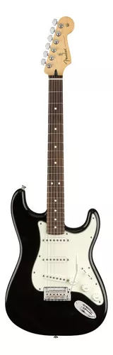

* Nombre: Matias Casiba
* Link Repo GitHub: https://github.com/MatiCasiba/drumstore
* Link Netlify: https://drumstore-ds.netlify.app/

# Proyecto Integrador - Etapa 1
En este proyecto crearé una página de productos con sus descripciones, trabajaré con html, scss y javaScript, todo esto estará hecho con vanilla:

## Base dada 

### Header
Ene el elemento header se encontrará la barra de navegación y un menú de opciones, las opciones la encontrarás en los elementos li, contendrá un menu toogle, este se verá cuando el dispositivo es chico:
```sh
    <header class="main-header">
      <input type="checkbox" id="menu">
      
      <nav class="nav-bar">
        <ul class="nav-bar__nav-list">
          <li class="nav-bar__nav-item">
            <a href="" class="nav-bar__nav-link">Inicio</a>
          </li>
          <li class="nav-bar__nav-item">
            <a href="" class="nav-bar__nav-link">Alta</a>
          </li>
          <li class="nav-bar__nav-item">
            <a href="" class="nav-bar__nav-link">Nosotros</a>
          </li>
          <li class="nav-bar__nav-item">
            <a href="" class="nav-bar__nav-link">Contacto</a>
          </li>
        </ul> <!-- nav-bar__nav-list -->
      </nav> <!-- nav-bar -->

      <div class="search-bar">
        <div class="search-bar__logo-container">
          
        </div>
        <form action="#" class="search-bar__form-container">
          <label for="busqueda" class="search-bar__form-label">Buscar</label>
          <input type="search" id="busqueda" class="search-bar__form-search">
          <button type="submit" class="search-bar__form-submit">Buscar</button>
        </form> <!-- search-bar__logo-container -->
        <div class="search-bar__carrito-container">C</div>
        <div class="menu-toogle">
          <label for="menu" class="menu-toogle__label">
            <span class="menu-toogle__top-bread"></span>
            <span class="menu-toogle__meat"></span>
            <span class="menu-toogle__bottom-bread"></span>
          </label>
        </div> <!-- .menu-toogle -->
      </div> <!-- .search-bar -->

    </header>
```

### Main
Dentro del elemento main, contendrá las tarjetas de los productos, donde verás la imágen de ellos y su descripcion, te mostraré el ejemplo de como se armó con uno de ellos:
```sh
<main>
    <section class="section-cards">
        <header class="section-cards__header">
          <h1>Lorem ipsum dolor sit amet consectetur.</h1>
          <p>Se encontraron X productos</p>
        </header>
    </section>

    <section class="cards-container">

        <div class="card">
          <article class="card__article">
            <div class="card__image-container">
              
            </div> <!-- card__image-container -->
            <div class="card__content">
              <h2 class="card__heading">Guitarra electrica fender player</h2>
              <div class="card__description">
                <p>Hablar de fender es entender la música en todo el mundoy en muchos géneros. Es una de las marcas líderes en definir los sonidos que escuchaamos. A su vez, satisface las necesidades de guitarristas al crear productos de calidad respaldarlos con un servicio y estabilidad...</p>
              </div>
            </div> <!-- card__content -->
          </article> <!-- card__image-container -->
        </div> <!-- card -->

    </section>
</main>
```
En el archivo scss le estarémos dando diseño a las tarjetas

### Carpeta SASS y sus archivos
Dentro de la carpeta sass (que se encuentra ubicada en la carpeta src) habrán carpetas que contendrán archivos dentro de las carpetas, aquí es donde estaré dando diseño a toda la página

#### Carpeta base 
En la carpeta base se encontrarán los archivos _resets y typography (extraeré una fuente de google fonts):
* _resets.scss
```sh
* {
    margin: 0; # quito los márgenes
    padding: 0; # quito los rellenos
    box-sizing: border-box; # orden de los elementos
}
```
* _typography.scss:
```sh
@import url('https://fonts.googleapis.com/css2?family=Open+Sans:ital,wght@0,300..800;1,300..800&display=swap');
body {
    font-family: "Open Sans", sans-serif;
    font-size: 100%; // default navegadores 16px
}
```
* _variables.scss -> este archivo va a servir para crear variables que los voy a poder aplicar en otros archivos, en este caso la usaré para manejar colores:
```sh
$color-1: #403d39;
$color-2: #252422;
$color-3: #eb5e28;
$color-4: #F6F6F6;
```
Al momento de usarlos se deberá relizar de la siguiente forma:
```sh
# en _header.scss:
@use '../base/variables';

# un ejemplo
background-color: variables.$color-3;
```

#### Carpeta components
En esta carpeta, se encontrará el diseño de las tarjetas, se han construido de la siguiente manera:

```sh
.card {
    min-width: 400px;
    max-width: 500px;
    height: 200px;

    background-color: ... ;
    border-top-left-radius: 5px;
    border-top-right-radius: 5px;
    overflow: hidden;
    box-shadow: 0 1px 5px 0 rgba(0,0,0,0.3);

    transition: transform .2s;

    &:hover,
    &:focus {
        /* radianes 2pi, gradianes 400, decimales 360 grdos, vueltas 1trun */
        transform: scale(1.03) skew(0deg) rotate(2deg);
        transform-origin: bottom;
        box-shadow: 0 7px 8px 0 rgba(0,0,0,0.5);
    }

    &__article {
        display: flex;
    }
    &__image{
        object-fit: cover;
        width: 100%;
        height: 100%;
    }

    &:nth-child(5n+1){
        background-image: linear-gradient(to top, #aaafad 0%, #f8accf 100%);
    }

    &:nth-child(5n + 2) {
        background-image: linear-gradient(to top, #696eff 0%, #f8accf 100%);
    }

    &:nth-child(5n + 3) {
        background-image: linear-gradient(to top, #ff1b6b 0%, #34caff 100%);
    }

    &:nth-child(5n + 4) {
        background-image: linear-gradient(to top, #ff930f 0%, #fff95b 100%);
    }

    &:nth-child(5n + 5) {
        background-image: linear-gradient(to top, #ff0f7b 0%, #f89b29 100%);
    }

    &__image-container {
        height: 200px;
        background-color: blue;
        overflow: hidden;
        clip-path: polygon(0 0, 100% 0, 95% 100%, 0% 100%); /* estado inicial */
    }

    &:hover &__image-container,
    &:focus &__image-container {
        clip-path: polygon(0 0, 100% 0, 100% 100%, 0% 100%); /* estado final */
    }

    /*  responsive -> 992px */

    @media screen and (min-width: 992px) {
        & {
            width: 220px;
            max-width: 300px;
            height: 400px;
        }

        &__article {
            flex-direction: column;
        }

        & &__image-container { /* .card .card__image-container */
            clip-path: polygon(0 0, 100% 0, 100% 200px, 0 180px); /* Estado inicial */
        }

        &:hover &__image-container,
        &:focus &__image-container {
            clip-path: polygon(0 0, 100% 0, 100% 190px, 0 200px); /* Estado final */;
        }
    }
    
}
```

#### Carpeta layout
En esta carpeta se encontrará todo el diseño del elemento header del html, la barra de navegación, el menu toogle, el buscador, un carrito, entre otras cosas:
* header:
```sh
.main-header{
    display: flex;
    flex-direction: column-reverse;

    @media screen and (min-width: 992px){
        &{
            flex-direction: column;
        }
    }
}

#menu{
    display: none;

    # para que funcione el menu toogle
    &:checked + .nav-bar{
        display: block;
    }
    &:checked ~ .search-bar .menu-toogle .menu-toogle__label{
        background-color: ... ;
    }
}
```

* navbar:
```sh
.nav-bar{
    background-color: ... ;
    display: none;

    &__nav-list{
        display: flex;
        flex-direction: column;
        justify-content: center;
        list-style-type: none;

        @media screen and (min-width: 992px){
            &{
                flex-direction: row;
            }
        }
    }

    &__nav-item{
        text-align: center;
        background-color: ... ;
    }

    &__nav-link{
        display: block;
        background-color: ... ;
        padding: 1rem 2rem; # quiere decir que su valor es -> 16px y 32px
        color: white;
    }

    @media screen and (min-width: 992px){
        &{
            display: block;
        }
    }
}
```

* search bar:
```sh
.search-bar{
    display: flex;
    background-color: ... ;
    justify-content: space-around;

    &__logo-container{
        width: 18.75rem;
        height: 3.5rem;
    }

    &__logo-img{
        max-width: 100%; # hace que la imagen nunca supere el tamaño del contenedor
        max-height: 100%; # evita que la imagen se salga del contenedor
        object-fit: contain; # Asegura que la imagen se ajuste sin recortarse
    }

    &__form-container{ # fondo del contenedor del buscador 
        padding: 1rem;
        background: linear-gradient(900deg, variables.$color-3, variables.$color-4);
        display: flex;
        flex-basis: 1000px;
        justify-content: center;
    }

    &__form-label{ # buscar 
        background-color: ... ;
    }

    &__logo-search{ # logo del buscador
        max-width: 20px;
        margin-right: 20px;
        
    }

    &__form-search{ #en esta clase se encuentra el input del buscador
        background-color: ... ;
    }

    &__form-submit{ # el boton de buscar 
        background-color: ... ;
    }

    &__carrito-container{
        flex: 0 0 3rem;
        background-color: ... ;
    }
}
```
Agregué 2 logos para el buscador y para el carrito de compra, le configuré su tamaño:
```sh
#index.html
<div class="search-bar">
    <div class="search-bar__logo-container">
       # el logo de la página
    </div>
    <form action="#" class="search-bar__form-container">
      <label for="busqueda" class="search-bar__form-label">
         # logo del buscador
      </label>
    </form>
    <div class="search-bar__carrito-container">
       #logo del carro
    </div>
</div>

# _header.scss
.search-bar{
    &__logo-search{
        max-width: 20px;
        margin-right: 20px;
        
    }

    &__cart-logo{
        width: 40px;
        margin: 5px 0 5px 0;
    }
}
```
También eh cambiado sus colores de fondo, lo encontrarás como: variables.$color-3 y variables.$color-4, también estarán las dos juntas para crear un degradado (background: linear-gradient(900deg, variables.$color-3, variables.$color-4);) 


* menu-toogle:
```sh
.menu-toogle{
    display: block;
    background-color: ... ;
    flex: 0 0 3rem;
    position: relative;
    cursor: pointer;

    &__label {
        display: block;
        background-color: ... ;
        height: 100%;
    }

    &__top-bread,
    &__meat,
    &__bottom-bread{
        display: block;
        background-color: ... ;
        height: .2rem;
        position: absolute;
        left: .5rem;
        right: .5rem;
    }

    &__top-bread{
        top: .8rem;
    }

    &__meat{
        top: 50%;
        margin-top: -.1rem;
    }

    &__bottom-bread{
        bottom: .8rem;
    }

    @media screen and (min-width: 992px) {
        & { # menu-toogle
            display: none;
        }
    }

}
```
* ACTUALIZACIÓN: eh modificado el sass del header, modifique el tamaño de los logos. Ahora el logo de la tienda se oculta cuando el dipositivo se mantenga en el rango de <576px, cuando sea >=576px, el logo se mostrará y cuando sea >=1200px ocupara gran parte del alto del header. Lo hice de la siguiente manera:
```sh
.search-bar{
    &__logo-img{
        opacity: 0; # oculto el logo

        @media screen and (min-width: 576px) {
            &{
                //!nuevo
                opacity: 1; # muestro el logo
                width: 60px;
                object-fit: contain;
                
            }
        }

        @media screen and (min-width:1200px) {
            &{
               width: 100px;
               position: relative; #se posisionará por arriba de otra clase o elemento que haya
            }
        }
    }

    &__logo-search{
        min-width: 20px;
        min-height: 20px;
        max-width: 30px; 
        max-height: 30px;
        object-fit: contain;
        flex-shrink: 0; # no permite que se reduzcan en flexbox
        
    }

    &__form-search{
        padding-left: 10px; # tendrá un espacio dentro del input al momento de escribir
    }

    &__cart-logo{
        min-width: 20px;
        min-height: 20px;
        max-width: 30px; 
        max-height: 30px;
        object-fit: contain;
        flex-shrink: 0;
        
    }
}
```

#### Carpeta src/sass/pages
Dentro de la carpeta pages que se encuentra ubicada dentro de la carpeta sass, se estará dando diseño a lo que contiene inicio, contacto y nosotros.
* _inicio.scss -> acá se dará diseño a la seccion de las tarjetas y el contenedor de las tarjetas:
```sh
.section-cards{
    background-color: #f1f2f3;
    padding: 1rem;
}

.cards-container{
    display: flex;
    flex-flow: row wrap;
    justify-content: center;
    gap: 1rem;
}
```

### Carpeta db
Dentro de la carpeta db se encontrará el archivo producto.js, donde contendrá todos los productos de la página con sus descripciones, a este se usará con el main.js.
```sh
# producto.js

const productos = [
    {
        id: 1,
        nombre: "Armory",
        foto: "image/armory.webp",
        descripcion: "Armory Shell Pack - Mapex AR628SFU",
        precio: 1819000.00
    },
    {
        id: 2,
        nombre: "Equinox",
        foto: "image/equinox.webp",
        descripcion: "Equinox - Mapex BPDLE628XFB",
        precio: 4899.00
    },
    {
        id: 3,
        nombre: "Mars Birch",
        foto: "image/mars-birch.webp",
        descripcion: "Mapex Mars Birch Shell Pack 529SF 5-Pc Rock Shell Pack",
        precio: 699.00
    },
    {
        id: 4,
        nombre: "Mars Maple",
        foto: "image/mars-maple.webp",
        descripcion: "Mars Maple Shell Pack - MAPEX MM529SFOG",
        precio: 1242140.00
    },
    {
        id: 5,
        nombre: "Saturn Evolution",
        foto: "image/saturn-evolution.webp",
        descripcion: "Saturn Evo Shell Pack - Mapex SE529XMPQ",
        precio: 2249990.00
    },
    {
        id: 6,
        nombre: "Venus",
        foto: "image/venus.webp",
        descripcion: "Venus - Mapex VE5294FTVC",
        precio: 1098535.00
    },
    {
        id: 7,
        nombre: "DW 50th anniversary",
        foto: "image/dw-50th-anniversary.webp",
        descripcion: "DW 50th Anniversary - Construidos con una combinación de caqui (persimmon) y abeto (spruce), maderas seleccionadas a mano para este modelo conmemorativo.",
        precio: 11999.00
    },
    {
        id: 8,
        nombre: "Parches Uno by Evans",
        foto: "image/set-parches-evans-uno.webp",
        descripcion: "Set Parches Uno By Evans UPG2CLS22 12'',13'',16'' doble capa,14'' ARENADO ,22'' EQ4 Capa simple con anillo",
        precio: "104061.50",
    },
    {
        id: 9,
        nombre: "Zildjian - Planet Z",
        foto: "image/platillos-zildjian-planet-z.webp",
        descripcion: "Set De Platillos Zildjian Planet Z Zp4pk 14-16-20",
        precio: 639981.30
    }
]

export default productos
```
Este archivo que contendrá la data de los productos, se unirá al main.js donde se creará dinamicamente, la estructura de las tarjetas que deberían de estar en el archivo html. Entonces lo que se crea el main.js, tomará la información del producto.js y se lo dará a la estructura html creada con js:
```sh
# main.js

import productos from './db/producto'
import './sass/main.scss'

console.log(productos) // array Productos

const contenedorProductos = document.getElementById('container-productos')
console.log(contenedorProductos)

const start = () => {
    console.warn('Se cargó todo el HTML')

    let html = ''
    
    productos.forEach(prod => {
        console.log(prod)
    
        html += `<div class="card">
            <article class="card__article">
                <div class="card__image-container">
                    
                </div>
                <div class="card__content">
                    <h2 class="card__heading">${prod.nombre}</h2>
                    <div class="card__description">
                        <p>${prod.descripcion}</p>
                    </div>
                </div>
            </article>
        </div>`
    })
    
    console.log(html) /* Voy a tener varios div.card * 9 -> */

    contenedorProductos.innerHTML = html

}

window.addEventListener('DOMContentLoaded', start)
```
* Nota: a casua de esta configuración, al momento de agregar otros porductos, no se necesitará armar todo en html, ya que lo tendremos armado en el main.js, por lo tanto, el contenido de tarjetas que se encontraba dentro del html, fue eliminado:
```sh
    <main>
      <section class="section-cards">
        <header class="section-cards__header">
          <h1>Lorem ipsum dolor sit amet consectetur.</h1>
          <p>Se encontraron X productos</p>
        </header>
      </section> <!-- section-cards -->

      <section class="cards-container" id="container-productos">
        # dentro de este section se encontraba el anterior contenido de tarjetas que fue reemplzado por el main.js
      </section>
    </main>
```

#### Modificación de los precios en producto.js
Se modifico la data de los precios, ahora se encuentran en comillas y con signos del dinero:
```sh
#ejemplos: 

precio: "$ 1.819.000,00"

precio: "US$ 4.899,00"
```

## Breakpoints
La página tendrá breakpoints, se pensó primero en realizarlo para un dispositivo mobil/celular, pero a medida que se agrande la pantalla (se ve en otro dispositivo, sea tablet o pc/notebook), se comportará de diferente manera la página

### Breakpoints en el heder
Todo lo trabajado del header, se encuentra en el archivo _header.scss dentro de la carpeta lyout:

* Medium -> cuando la pantalla sea >=768px:
```sh
.search-bar{

    &__form-search{
        @media screen and (min-width: 768px) {
            & {
                width: 70%;
            }
        }
    }
    
    &__cart-logo{
        
        @media screen and (min-width: 768px){
            max-height: 35px;
        }
    }
}
```

* Large -> cuando la pantalla sea >=992px:
```sh
.nav-bar{
    &__nav-list{

        @media screen and (min-width: 992px){
            &{
                flex-direction: row;
                justify-content: center;
                font-size: 0.7rem;
            }
        }
    }

    &__nav-link{
        position: relative;
        @media screen and (min-width: 992px) {
            &{
                font-size: 1rem;
                font-weight: 600;
                letter-spacing: 2px;
            }
            &:active{
                color: variables.$color-1;
            }
        }
       
}

.search-bar{

    height: 3.7rem;

    &__logo-container{

        @media screen and (min-width: 992px){
            &{
                width: 5rem;
                height: 4rem;
                margin-left: 10px;
            }
        }
    }

    &__form-container{
        @media screen and (min-width: 992px){
            &{
                max-width: 100%;
            }
        }
    }

    &__logo-search{
        @media screen and (min-width: 992px){
            &{
                max-height: 30px;
            }
        }
        
    }

    &__form-search{
        @media screen and (min-width: 992px){
            &{
                width: 30%;
                margin-left: 20px;
            }
        }
        
    }

    &__carrito-container{
        flex: 0 0 3rem;
        background: linear-gradient(900deg, variables.$color-3, variables.$color-4);

        @media screen and (min-width: 992px){
            &{
                flex: 0 0 5rem;
                margin: auto;
                background: none;
            }
        }
    }

}
```
* Extra-large -> Cuando la pantalla >= 1200px el nav-bar pasará a estar debajo del search-bar y los links tendrán una animación de subrayado : 
```sh
.main-header{
    
    @media screen and (min-width: 1200px){
        & {
            flex-direction: column; # mantiene la disposicion en columna 
            align-items: center; # centra los elementos 
        }
    }

.nav-bar{

    &__nav-list{
        @media screen and (min-width: 1200px){
            font-size: 0.9rem;
        }
    }

    &__nav-link{
        @media screen and (min-width: 1200px) {
            &{
                background: variables.$color-3;
                color: variables.$color-4;
                font-size: .8rem;
            }

            # con esta parte, le daré un animacion se subrayado cuando el usuario se pare sobre los links
            &::after {
                content: "";
                position: absolute;
                left: 0;
                bottom: 0;
                width: 0;
                height: 2px;
                border-radius: 100%;
                margin-bottom: 10px;
                background-color: variables.$color-4;
                transition: width 0.3s ease-in-out;
            }

            &:hover::after {
                width: 100%;
            }
        }
    }

.search-bar{

    &__form-search{

        @media screen and (min-width: 1200px) {
            & {
                width: 50%;
            }
        }
    }

    @media screen and (min-width: 1200px) {
        & {
            order: 1;
            width: 100%;
        }
    }

}
```

## Diseño en tarjetas
Eh agregado algunas configuraciones a la tarjeta, como darle algo de espacio a los textos dentro para que no estén tan pedgado el titulo con la descripción, reducí un poco el alto de las tarjetas. Ahora El contenedor de tarjetas ahora no se puede extender más de 1400px, todo esto se encuentra en cards.scss que está dentro de la carpeta components:

```sh
# las nuevas configuraciones agregadas

@use '../base/variables'; # lo necesito pasa usar los colores 

main{
    background-color: variables.$color-4;
}
.section-cards{
    display: flex;

    &__header{
        width: 100%;
        max-width: 1200px;
        margin: 0 auto;
    }
}

.cards-container{
    background-color: variables.$color-4;
    padding: 3%;
    width: 100%;
    max-width: 1400px;
    margin: 0 auto;
}

.card {

    background-color:  variables.$color-3;
    color: variables.$color-1;

    &__content{
        padding: 2%;
    }
    &__description{
        margin-top: 20px;
        width: 200px;
        font-size: 0.9rem;
    }

    @media screen and (min-width: 992px) {
        & {
            width: 220px;
            max-width: 300px;
            height: 350px;
        }
    }
}
```

### Boton de compra
En la tarjeta se encuentra el boton de compra, tuve que agregarlo en el js para que se encuentre dentro de la tarjeta, no será un elemento button, sino que será un elemento de anclaje, lo ubiqué dentro del contenedor con la clase "card__content":
```sh
html += `<div class="card">
            <article class="card__article">
                <div class="card__image-container">
                    
                </div>
                <div class="card__content">
                    <h2 class="card__heading">${prod.nombre}</h2>
                    <div class="card__description">
                        <p><b>${prod.precio}</b></p>
                        <p>${prod.descripcion}</p>
                    </div>
                    # ac+a se encuentra el boton
                    <a class="card__boton" href="#">COMPRAR</a>
                </div>
            </article>
        </div>`
```
* Su configuración en sass (esta en el archivo _cards.scss):
```sh
.card {
    display: flex;
    flex-direction: column;

    &__content{
        display: flex;
        flex-direction: column;
        justify-content: space-between; # distribuyo el contenido y empujo el botón hacia abajo
        flex-grow: 1; # logro que el contenido ocupe el espacio restante
        padding: 2%;

    }

    &__boton {
        text-decoration: none;
        font-size: 0.8rem;
        margin-top: auto; # Empuja el botón hacia abajo
        display: block;
        text-align: center;
        padding: 10px;
        background-color: variables.$color-1;
        color: variables.$color-3;
        border-radius: 5px;
    }
```
Te explicaré como fueron sus ajustes dentro del __content:
* display: flex; flex-direction: column; -> Organiza los elementos verticalmente dentro del contenido de la tarjeta
* justify-content: space-between; -> Distribuye los elementos de manera uniforme, dejando el botón al final
* flex-grow: 1; -> Permite que el contenido ocupe el espacio disponible, empujando el botón hacia abajo


### Breakpoints de la tarjeta
La tarjeta se comportará de distintas maneras respecto al tamaño de pantalla, cuando la pantalla sea >=1200px, las tarjetas tendrán animaciones, le eh quitado las animaciones menor a este tamaño ya que serán pantallas en dispositivos mobil (tambien entran las tablet):

* Large -> cuando la pantalla sea >= 992px: esta dentro de las categorias de la tablets, por lo tanto seguirá sin animaciones. En el caso de que haya un usuario con una notebook >=992px, solo cuando se pare sobre la tarjeta, verá que la linea en diagonal que dibide la descripcion de la imgane, se mueve:

```sh
 .card{
    @media screen and (min-width: 992px) {
        & {
            display: flex;
            flex-direction: column;
            height: 100%;
        }

        &__article {
            flex-direction: column;
        }

        & &__image-container {
            clip-path: polygon(0 0, 100% 0, 100% 200px, 0 180px);
        }
        &:hover &__image-container,
        &:focus &__image-container {
            clip-path: polygon(0 0, 100% 0, 100% 190px, 0 200px);
        }

        &__heading {
            font-size: 1.5rem;
        }

        &__content {
            display: flex;
            flex-direction: column;
            justify-content: space-between;
            flex-grow: 1; # Ocupa todo el espacio disponible
            height: 100%; # Asegura que ocupe toda la altura de la tarjeta
        }

        # tamaño de letras/numeros y el ancho del
        &__description{
            width: 300px;
            font-size: 1rem;
        }

        &__boton {
            margin-top: 20px; # Empuja el botón al final del contenido
            display: block;
            text-align: center;
            padding: 10px;
            background-color: variables.$color-1;
            color: variables.$color-3;
            border-radius: 5px;
        }
    }
 }
```

Extra-large -> Cuando la pantalla sea >= 1200px: Cuando haya este tamaño de pantalla, entonces estamos hablando de una notebook o un pc, por lo tanto este tendrá animacion en las tarjetas y se verá de distinta manera a las otras tarjetas cuando el dispositivo es chicio, lo notarás con el botón de comprar:
```sh
.card{

    @media screen and (min-width: 1200px) {
        & {
            height: 100%;
            display: flex;
            flex-direction: column;
            justify-content: space-between; # Asegura que los elementos se distribuyan correctamente 
        }
    
        &__image-container {
            height: 220px;
            overflow: hidden;
        }
    
        &__heading {
            font-size: 1.5rem;
            text-align: center;
            
        }
    
        &__description {
            margin-top: 15px;
            margin-left: 5px;
            width: 400px;
            font-size: 1rem;
        }
    
        &__content {
            flex: 1; # Permite que el contenido crezca, dejando espacio para el botón
            display: flex;
            flex-direction: column;
            padding: 0;
            
        }
    
        &__boton {
            margin-top: 20px; #Empuja el botón hacia la parte inferior 
            padding: 10px;
            text-align: center;
            display: block;
            width: 100%; # Hace que ocupe todo el ancho de la tarjeta 
            background-color: variables.$color-1; #Asegura que tenga un fondo visible 
            color: variables.$color-3;
        }
    
        # esto es la animacion cuando el usuario se pare sobre las tarjetas
        &:hover,
        &:focus {
            /* radianes 2pi, gradianes 400, decimales 360 grdos, vueltas 1trun */
            transform: scale(1) skew(0deg) rotate(2deg);
            transform-origin: bottom;
            box-shadow: 0 7px 8px 0 rgba(0, 0, 0, 0.5);
        }
    }
    
}
```

## Contacto
En contacto vamos a tener un archivo contacto.html y contacto.js(acá se va a importar el main.sass), estos archivo se encuentra en src>pages>contacto. Dentro de esye archivo tendrá el header del index.html y habrá un formulario, tambien se le agregará un mapa de donde se encuentra el lugar.

### Main
Dentro el elemento main que esta dentro estará el contenido del formulario, se armo de la siguiente forma:
```sh
<main>

        <div class="formulario">
            <form action="#" method="post">
                <h1 class="formulario__titulo">Contáctanos</h1>
                
                <div class="formulario__contenedro-datos">
                  <div class="formulario__datos">
                      <label for="">Nombre *</label>
                      <input type="text" class="formulario__entrada-datos">
                  </div>
                  <div class="formulario__datos">
                      <label for="">Apellido *</label>
                      <input type="text" class="formulario__entrada-datos">
                  </div>
                  <div class="formulario__datos">
                      <label for="">Email *</label>
                      <input type="email" name="email" class="formulario__entrada-datos">
                  </div>
                  <div class="formulario__datos">
                      <label for="">Escribenos un mensaje:</label>
                      <textarea class="formulario__entrada-datos" name="mensaje"></textarea>
                  </div>
                  <div class="formulario__datos">
                      <button class="formulario__boton" type="submit">Enviar</button>
                  </div>
                </div><!-- __contenedor-datos -->

            </form>
        </div> <!-- formulario -->

      </main>
```
### Diseño en sass (_contacto.scss):
Le estaré dando diseño a este formulario en el archivo _contacto.scss que se encuentra src>sass>pages
```sh
html{
    background-color: variables.$color-4;
}

# diseño de los textos que se encuentran arriba de los inputs
label{
    margin-top: 10px;
    letter-spacing: 2px;
    font-weight: 700;
}

# diseño del todo el formuario
.formulario{
    background-color: variables.$color-4;
    font-size: 1.2rem; #tamaño de letras
    height: 100%;
    padding: 40px; #relleno

    &__titulo{
        font-weight: 900;
        color: variables.$color-3;
        text-align: center;
        text-shadow: 2px 3px 1px variables.$color-2;
        border-radius: 20px;
        padding: 5px;
        margin: 15px 15px 45px 15px;
    }
    
    #organizando los inputs y label
    &__datos{
        display: flex;
        flex-direction: column;
        align-items: center;
        gap: 10px;
    }

    &__entrada-datos{
        width: 70%;
        padding: 4px;
        border-left: none;
        border-top: none;
        border-right: none;
        background-color: variables.$color-4;

    }

    #diseño del boton
    &__boton {
        text-align: center;
        margin-top: 20px;
        padding: 10px 20px;
        border: none;
        border-radius: 20px;
        background-color: variables.$color-3;
        cursor: pointer;
    }
}
```

### Ajustando el elemento textarea
En la parte donde el usuario puede dejar un mensaje (que es un elemento textarea), hice que solo se extienda hacia abajo y no a los costados, tendrá un límite de hasta donde se puede exteneder:
```sh
textarea{
    resize: vertical; # me permite que se extienda solo verticalmente
    height: 80px;
    max-height: 200px;
}
``` 

### Agrego un mapa en contacto
A parte del formulario que se encuentra en contacto, tambien le agregue un mapa con la unicación, se hace de la siguiente manera
```sh
<div class="formulario__contenedor-map">
      <iframe src="https://www.google.com/maps/embed?pb=!1m18!1m12!1m3!1d26272.95191432217!2d-58.40476192424162!3d-34.60115252873014!2m3!1f0!2f0!3f0!3m2!1i1024!2i768!4f13.1!3m3!1m2!1s0x95bccac630121623%3A0x53386f2ac88991a9!2sTeatro%20Col%C3%B3n!5e0!3m2!1ses-419!2sar!4v1738586641675!5m2!1ses-419!2sar" width="400" height="300" style="border:0;" allowfullscreen="" loading="lazy" referrerpolicy="no-referrer-when-downgrade"></iframe>
</div>
```
* Su configuracion en sass:
```sh

#para centrar el mapa y darle un espacio en el margen de arriba para que no se encuentre tan pegado al boton
&__contenedor-map{
    display: flex;
    justify-content: center;
    align-items: center;
    margin-top: 30px;
}
```

### Breakpoints del contacto
Verás que el formulario actuará de diferente manera respecto a sus posiciones y tamaños, te mostraré como lo trabajé:
* medium -> cuando la pnatalla sea >= 768px:
```sh
label{

    @media screen and (min-width: 768px) {
        &{
            font-weight: 600;
        }
    }
}

.formulario{
    @media screen and (min-width: 768px) {

        &{
            font-size: 1.5rem; #tamaño de la letra
        }

        &__entrada-datos {
            width: 50%;
        }

        iframe{
            width: 70%;
        }
    }
}
```

* Extra-large -> cuando la pantalla sea >= 1200px. Cuando la pantalla alcance este valor, el formulario y el mapa estará uno al lado del otro, para lograrlo lo trabajé de la siguiente manera:
```sh
@media screen and (min-width: 1200px) {

        #aplique display: flex al form en vez de a la clase .formulario
        form {
            display: flex;
            justify-content: center;
            align-items: flex-start; # hago que los elementos dentro del form se alineen arriba (en la parte superior) en lugar de centrarse verticalmente
            gap: 10px; 
        }

        &__contenedor-datos {
            flex: 1;
            max-width: 500px;
        }
        &__contenedor-map {
            flex: 1;
            display: flex;
            justify-content: center;
        }
        #los flex: 1 en los dos contenedores, hace qye ambos ocupen el mismo espacio disponible dentro del form

        &__entrada-datos {
            width: 70%;
            font-size: 1.1rem;
        }

        &__boton{
            font-size: 1.1rem;
        }
        &__boton:hover{
            box-shadow: 3px 5px 10px black;
        }

        iframe {
            width: 100%;
            max-width: 500px;
            height: 580px;
        }
    }
```

* Extra extra large -> cuando la pantalla sea >= 1400. Notarás que no se extiende el formulario ni el mapa, tambien que queda centrado, para lograrlo, lo trabajé del siguiente modo:
```sh
@media screen and (min-width: 1400px){
        &{
            display: contents;
            justify-content: center;
            font-size: 1.6rem;
        }

        form{
            max-width: 1300px; # no se extendrá más de esto
            width: 100%; # ocupará el ancho total del espacio proporcionado
            display: flex;
            justify-content: center;
            align-items: flex-start;
            margin: 0 auto; # centro el formulario en la pantalla
        }

        &__entrada-datos{
            padding: 8px;
            font-size: 1.2rem;
        }

        iframe{
            height: 600px;
        }
        
    }
```

### Modificiacion del sass
En el archivo contacto.html le agregué clases a los labels y modifiqué la configuración de este, el motivo por el cual lo hice es porque mientras estaba configurando los labels del formulario, estaba tocando a la vez los del index.html, lo cual me modificó el header que tiene el index. Entonces para solucionar esto, le agregué clases a los labels de contacto.html:
```sh
# un ejemplo en html
<label class="formulario__labels" for="">Nombre *</label>

# sass
.formulario{
    &__labels{
        margin-top: 20px;
        letter-spacing: 2px;
        font-weight: 700;
    }
}
```

## Nosotros
En la carperta nosotros, se encuentra toda la descripcion del local, la estructura de esta lo hice simple:
```sh
    <main>
        <div class="info">
            <p class="info__textos">Hemos estado atendiendo a bateristas desde 1987 en el corazón de Amberes; Drumstore no necesita presentación. En estas páginas encontrarás un resumen de los productos y servicios que ofrecemos.</p>
            <p class="info__textos">Además de las numerosas marcas con las que trabajamos, también puedes contactarnos para reparaciones de baterías, backline y alquileres.</p>
            
            <p class="info__textos">Si quieres deshacerte de esa batería vieja que tienes en el ático, simplemente contáctanos.</p>
            
            <p class="info__textos">Sabemos que comprar un instrumento de percusión requiere un ambiente tranquilo, donde no sea un vendedor quien hable, sino el propio instrumento. Por ello, hemos decidido trasladar nuestra tienda a un lugar tranquilo fuera de la ciudad, donde solo atendemos con cita previa. Conversamos sobre lo que buscas, preparamos un set para que compares distintos productos, te asesoramos cuando es necesario, etc.</p>
            
            <p class="info__textos">En un mundo de automatización, centros de llamadas y generalización, hemos elegido un enfoque completamente personalizado para nuestros clientes.</p>
            <p class="info__textos">Ofrecemos soporte técnico profesional para baterías, tanto en escenarios como en estudios de grabación. Alquilamos baterías, platillos y una amplia variedad de instrumentos de percusión para conciertos y estudios.</p>
            
            <p class="info__textos">Los productos profesionales y exclusivos para bateristas son nuestra pasión. Envíanos tu rider y te daremos nuestra mejor oferta.</p>
        </div>
      </main>
```
### Imagenes
Eh agregado imagenes en nosotros.html, tendrán una clase que me serviran para despues darle diseño a las imágenes
```sh

```

### Diseño de nosotros
Lo  que haré en el archivo _nosotros.scc, iré trabajando con ajustes de tamaño y una animación en las imágenes

* Ajustes de tamaños:
```sh
img{
    width: 100%;
    height: auto;
}
.info{
    margin: 50px 50px 50px 50px;
    
    &__textos{
        font-size: 1.4rem;
        letter-spacing: 1px;
        margin-bottom: 15px;
        font-weight: 500;
    }
}
```

### Animación de las imágenes
Como mencioné anteriormente, voy a estaragregando una animación a las imágenes que se notará cuando vayas haciendo scroll hacia abajo, te mostraré como lo eh hecho:
```sh
@keyframes show {
    from{
        opacity: 0;
        scale: 25%;
    }
    to{
        opacity: 1;
        scale: 100%;
    }
}

.info{

    &__image-drummers{
        view-timeline-name: --image; # este nombre está enlasado al scroll
        view-timeline-axis: --block; # le digo que eje es el que tiene que mirar el scroll, en este caso el vertical

        animation-timeline: --image; #enlaso el escroll y el elemento que se va a animar
        animation-name: show; #la animación que voy a usar

        animation-range: entry 25% cover 60%;
        #cuando el usurio está viendo el 25% de la imagen, entonces es cuando se empieza animar
        # termina totalmente la animaciónm cuando el elemento se esté mostrando en un 60%

        animation-fill-mode: both; # relleno la animación hacia los dos sentidos, yendo para adelante y hacia atrás, sin esto el problema que tengo es que va a estar la animación al 100% y cuando inicie empezará desde 0.

        border-radius: 5px;
    }
}

```
* keyframes show: tendrá 2 puntos, el from que será el momento del 0% donde tendremos una opacidad de 0 y la escala al 25% (las imagenes cuando se inicien será transparentes y que sean un 25% de su tamaño). Despues al final tendremos opacidad de 1 (veremos la imagen sin ninguna transparencia), y la escala estará al 100%, osea que la imagen ocupara lo que debería de ocupar

### Breakpoints en el archivo nosotros.html
Estaré ajustando los tamaños de letra e imagen en cada tipo de pantalla
* Medium -> Cuanndo la pantalla sea >=768px:
```sh
.info{

    @media screen and (min-width: 768px){
        &__titulo{
            margin-left: 15%;
        }
        &__textos{
            max-width: 70%;
            font-size: 1.8rem;
            margin: 0 auto;
        }

        &__image-drummers{
            display: block;
            margin: 0 auto; # centra la imagen horizontalmente
            max-width: 70%;
        }
    }
```

* Large -> Cuanndo la pantalla sea >=992px:
```sh
.info{
    @media screen and (min-width: 992px){
        &__textos{
            font-size: 1.5rem;
        }
    }
}
```

* Extra large -> Cuanndo la pantalla sea >=1200px:
```sh
.info{
    @media screen and (min-width: 1200px){

        &__titulo{
            text-align: center;
            margin: 0;
            margin-bottom: 50px;
        }
        
        &__textos{
            font-size: 1.4rem;
            max-width: 60%;
        }

        &__image-drummers{
            max-width: 60%;
        }
    }
}
```

* Extra extra large -> Cuanndo la pantalla sea >=1400px:
```sh
.info{
    @media screen and (min-width: 1400px){
        &{
            max-width: 1100px; # no se podrá extender más de este tamño
            margin: 40px auto;
        }

        &__titulo{
            text-align: center;
            font-size: 3rem;
        }
        &__textos{
            font-size: 1.4rem;
        }
    }
}
```

## ViteConfig.js
La configuración de este archivo me va a permitir reconocer los demás archivos html, si no tengo esta configuración mi página solo procesaria el index.html y me ignora los demás archivos:
```sh
import {resolve} from 'path' /* node */

export default{
    css: {
        devSourcemap: true // configuramos para ver la linea donde esta escrita la regla css
    },
    build: {
        rolluOptions: {
            input:{
                main: resolve(__dirname, 'index.html'),
                contacto: resolve(__dirname, 'src/pages/contacto/contacto.html'),
                nosotros: resolve(__dirname, 'src/pages/nosotros/nosotros.html')
            }
        }
    }
}
```


